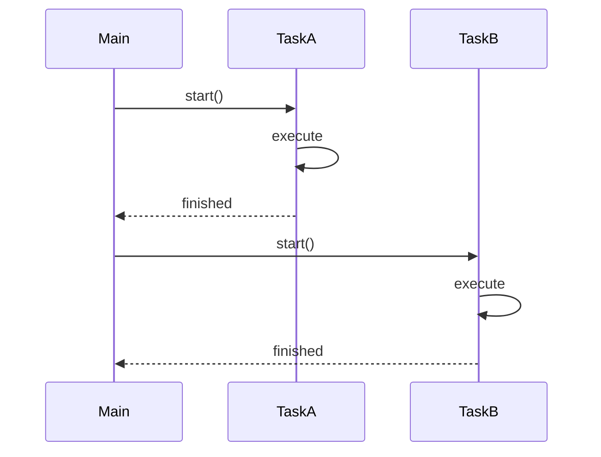
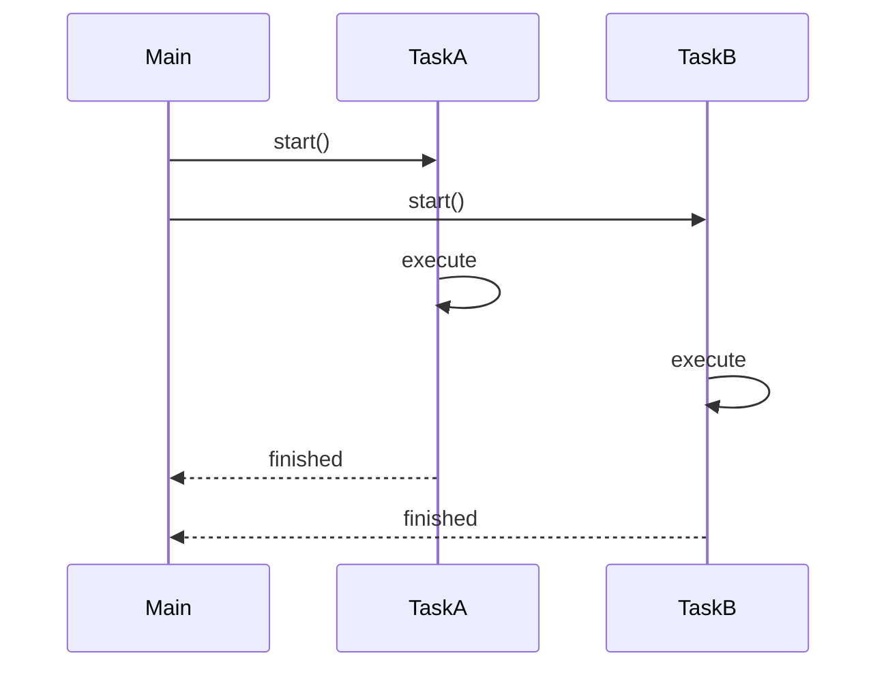

```
- 동기 / 비동기 / 블럭킹 / 논블럭킹
- 스레드 & 컨텍스트 스위칭 & 비동기(동시성과 병렬성)
- @Async 동작 원리 & 비동기 + 논블럭킹
- Thread per request & EventLoop Model
	- Tomcat & Netty(BIO, NIO Connector)
```

---

## 요약
### 블로킹 & 논블록킹
- 작업의 수행 여부를 결정하는 방식
- I/O를 담당하는 함수를 호출했을 때 자신의 작업을 하느냐 안하느냐
	- 블록킹: 바로 시작하지 않음
		- 따라서, 자원을 효율적으로 사용하지 못함
	- 논블록킹: 바로 시작함
		- 단, 작업의 완료를 체크하고 결과를 처리하는 로직이 필요
> 제어권??
> - 자신(함수)의 코드를 실행할 권리. 즉, 다른 작업이 시작됐을 때 내 작업을 시작할 수 있는가
> - 제어권이 없다 == 호출된 함수가 자신의 작업을 마칠때까지 호출한 함수에게 제어권을 반환하지 않는다면 호출한 함수는 다른 작업을 수행할 수 없음


### 동기 & 비동기
- 작업의 완료 시점을 어떻게 처리할지에 대한 방식
- I/O를 담당하는 함수의 작업 완료 여부를 신경쓰냐 안쓰냐
	- 동기: 신경씀
		- 작업이 완료 결과를 받자마자 바로 처리
		- 특정 작업이 길어질 경우 전체 처리 속도에 영향을 받게 됨 (작업 중 하나라도 처리가 길어지면 전체 처리 속도가 느려짐)
	- 비동기: 신경쓰지않음
		- 작업이 완료 결과를 받자마자 바로 처리하지 않음
		- 동기 방식에 비해 처리 속도가 유연하지만 작업의 완료와 결과 처리를 위한 메커니즘으로 복잡도가 증가됨
> 결과값을 기다린다??
> - A 함수에서 B 함수를 호출했을 때 B함수의 결과를 받아야 다음 작업을 수행할 수 있다면 결과값을 기다린다고 할 수 있음
> - 그런데 만약, A 함수가 B 함수를 호출하고나서 B 함수의 결과와 상관없이 A 함수의 작업을 수행한다면 결과값을 기다리지 않는다고 할 수 있고, 작업의 완료와 결과 처리는 별도의 메커니즘으로 처리됨


---


## 블럭킹 & 논블럭킹
작업의 수행 여부를 결정하는 방식

### 블럭킹
- 메인 플로우의 제어권이 호출된 쪽으로 넘어가면 메인 플로우는 제어권을 상실하여 자신의 작업을 중단한 채 해당 제어권이돌아오기를 기다리는 상태

**순서**
1. A 함수가 B함수를 호출
2. A 함수는 작업이 전부 수행될 때까지 대기
3. B 함수의 작업이 완료하면 작업이 전부 수행되어 A 함수가 다시 실행됨


```java
biz logic start...               (A 함수)
데이터베이스에서 데이터를 가져오는 중...         (B 함수)
[블록킹 작업] 완료. 결과: 김철수              (B 함수)
[메인 스레드] 다른 작업 수행 중... 1    (A 함수)
[메인 스레드] 다른 작업 수행 중... 2    (A 함수)
[메인 스레드] 다른 작업 수행 중... 3    (A 함수)
[메인 스레드] 다른 작업 수행 중... 4    (A 함수)
[메인 스레드] 다른 작업 수행 중... 5    (A 함수)
```


### 논블럭킹
- 메인 플로우의 제어권이 호출된 쪽으로 넘어가자마자 메인 플로우으로 제어권을 즉시 반환받고 본인의 플로우를 곧바로 작업 가능한 상태

**순서**
1. A 함수가 B함수를 호출
2. A 함수는 곧바로 제어권을 반환받아 B 함수의 작업이 수행되는 것과 관계없이 A 함수의 작업을 진행함


```java
biz logic start...                         (A 함수)
[논블록킹 작업] 데이터베이스에서 데이터를 가져오는 중...      (B 함수)
[메인 스레드] 다른 작업 수행 중... 1              (A 함수)
[메인 스레드] 다른 작업 수행 중... 2              (A 함수)
[메인 스레드] 다른 작업 수행 중... 3              (A 함수)
[메인 스레드] 다른 작업 수행 중... 4              (A 함수)
[메인 스레드] 다른 작업 수행 중... 5              (A 함수)
```


---


## 동기 & 비동기
작업의 완료 시점을 어떻게 처리할지에 대한 방식.
즉, 결과를 돌려주었을 때 결과에 관심이 있는지 없는지에 대한 여부

**동기** 
(같은) (시각)
Syn + chrono + us
(with) (time)
-> 작업의 순서가 보장된다.

비동기
-> 작업의 순서가 보장되지 않는다.

> 가장 중요한 것은 제어권의 반환과 결과값의 전달에 시간을 맞춘다. (= 순서)


### 동기
- 작업을 동시에 수행하거나 동시에 끝나거나 끝나는 동시에 시작함을 의미


#### 방법A: A 작업이 혼자 시작해서 혼자 끝나고, B 작업도 혼자 시작해서 혼자 끝남



```java
final long start = System.currentTimeMillis();  
instance.taskA(); // sleep(2000). A 함수 호출  
instance.taskB(); // sleep(3000). A 함수가 종료된 후 B 함수 호출
final long end = System.currentTimeMillis();  
  
System.out.println("All tasks finished execute time = " + (end - start));

-----------
  실행 결과 
-----------
Task A started
Task A finished
Task B started
Task B finished
All tasks finished execute time = 5008
```


#### 방법B: A 작업과 B 작업이 같이 시작해 같이 끝남


```java
Thread taskA = new Thread(instance::taskA);  // sleep(2000)
Thread taskB = new Thread(instance::taskB);  // sleep(3000)
  
final long start = System.currentTimeMillis();  
taskA.start();
taskB.start(); 
taskA.join();  // -> taskA 스레드가 완료될 때까지 메인 스레드를 대기
taskB.join();  // -> taskB 스레드가 완료될 때까지 메인 스레드를 대기
final long end = System.currentTimeMillis();  
  
System.out.println("All tasks finished execute time = " + (end - start));

-----------
  실행 결과: 전체적인 실행 흐름은 동기적임
-----------
Task B started
Task A started
Task A finished
Task B finished
All tasks finished execute time = 3005
```


### 비동기
- 시작, 종료가 일치하지 않으며 작업이 완료되더라도 곧바로 시작하지 않음을 의미
	- 작업중에 끼어들어도 괜찮다
	- 작업들의 시작과 끝이 다르다


#### 방법 A: A 함수의 작업이 진행중에 B 함수의 작업이 시작되고, A 함수가 끝나고 B 함수가 끝남


```java
CompletableFuture<Void> futureA = CompletableFuture.runAsync(this::taskA);  // taskA: sleep(2000)
CompletableFuture<Void> futureB = CompletableFuture.runAsync(() -> {        // taskB: sleep(3000)
    sleep(500); // TaskA 시작 후 0.5초 뒤에 TaskB 시작  
    taskB();  
});  
  
futureA.thenRun(() -> System.out.println("Task A finished"));  
futureB.thenRun(() -> System.out.println("Task B finished"));
  
-----------
  실행 결과 
-----------
Task A started
Task B started
Task A finished
Task B finished
```


#### 방법 B: A 함수의 작업이 진행중에 B 함수의 작업이 시작되고, B 함수가 끝나고 A 함수가 끝남


```java
CompletableFuture<Void> futureA = CompletableFuture.runAsync(this::taskA);  // taskA: sleep(2000)
CompletableFuture<Void> futureB = CompletableFuture.runAsync(() -> {        // taskB: sleep(1000)
    sleep(500); // TaskA 시작 후 0.5초 뒤에 TaskB 시작  
    taskB();  
});  
  
futureA.thenRun(() -> System.out.println("Task A finished"));  
futureB.thenRun(() -> System.out.println("Task B finished"));

-----------
  실행 결과 
-----------
Task A started
Task B started
Task B finished
Task A finished
```


---

## I/O Model (2 X 2 개념 믹스)
- **Synchronous & Blocking: Blocking I/O**
- Synchronous & Non-blocking: Non-blocking I/O
- Asynchronous & Blocking: Multiplexing I/O
- **Asynchronous & Non-blocking: Asynchronous I/O**


#### Synchronous & Blocking: Blocking I/O
- 동기: 작업의 완료를 신경 씀
	- 작업을 동시에 수행하거나 동시에 끝나거나 끝나는 동시에 시작함을 의미
- 블록킹: 제어권이 없으면 호출된 작업이 끝나기를 기다림
-> 블록킹 방식이기 때문에 제어권이 없으면 작업을 수행할 수 없어서 호출한 작업이 완료될 때까지 기다려야 하고, 
-> 동기 방식이므로 작업이 완료되자마자 결과를 처리한다.
```bash
===== [Sync][Blocking] - 시작 =====
메인 스레드는 결과를 기다리는 동안 블로킹됩니다. - 시작
동기 작업 시작
동기 작업 종료
메인 스레드는 결과를 기다리는 동안 블로킹됩니다. - 종료
complete execute name = 김철수
===== [Sync][Blocking] - 종료 =====
```

```java
System.out.println("===== [Sync][Blocking] - 시작 =====");  
  
System.out.println("메인 스레드는 결과를 기다리는 동안 블로킹됩니다. - 시작");  
final String result = getById(2L); // 가상의 I/O 작업 시간이 2초라고 가정
System.out.println("메인 스레드는 결과를 기다리는 동안 블로킹됩니다. - 종료");  
System.out.println("complete execute name = " + result);  
  
System.out.println("===== [Sync][Blocking] - 종료 =====");
```


#### Asynchronous & Non-blocking: Asynchronous I/O
- 비동기: 작업의 완료를 신경 쓰지 않음
	- 시작, 종료가 일치하지 않으며 작업이 완료되더라도 곧바로 시작하지 않음을 의미
- 논블록킹: 호출한 쪽으로 제어권이 넘어가자마자 메인 플로우로 제어권을 즉시 반환받고 본인의 플로우는 작업 가능한 상태가 됨
-> 논블로킹 방식이기 때문에 메인 스레드는 다른 작업을 수행할 수 있고,
-> 작업이 완료되었을 때 콜백을 통해 결과를 반환한다.
```bash
===== [Async][Non-Blocking] - 시작 =====
메인 스레드는 비동기 작업의 완료를 기다리지 않고 계속 실행됩니다.
[비동기 작업] 작업B 진행중... 1
[비동기 작업] 작업A 진행중... 1
[비동기 작업] 작업B 진행중... 2
>> [메인 스레드] 작업  진행중... 1
[비동기 작업] 작업B 진행중... 3
[비동기 작업] 작업A 진행중... 2
[비동기 작업] 작업B 진행중... 4
[비동기 작업] 작업B 진행중... 5
>> [메인 스레드] 작업  진행중... 2
[비동기 작업] 작업A 진행중... 3
[비동기 작업] 작업A 진행중... 4
>> [메인 스레드] 작업  진행중... 3
[비동기 작업] 작업A 진행중... 5
------ 모든 비동기 작업 완료 ------
complete futureA result = 김철수
complete futureB result = 이영희
>> [메인 스레드] 작업  진행중... 4
>> [메인 스레드] 작업  진행중... 5
메인 스레드 작업 완료
===== [Async][Non-Blocking] - 종료 =====
```

```java
System.out.println("===== [Async][Non-Blocking] - 시작 =====");  
  
CompletableFuture<String> futureA = CompletableFuture.supplyAsync(() -> {  
    for (int i = 1; i <= 5; i++) {  
        sleep(200);  
        System.out.println("[비동기 작업] 작업A 진행중... " + i);  
    }  
    return repository.get(2L);  // 2초 후 완료  
});  
CompletableFuture<String> futureB = CompletableFuture.supplyAsync(() -> {  
    for (int i = 1; i <= 5; i++) {  
        sleep(100);  
        System.out.println("[비동기 작업] 작업B 진행중... " + i);  
    }  
    return repository.get(3L);  // 1초 후 완료  
});  
  
CompletableFuture.allOf(futureA, futureB)  
        .thenRun(() -> System.out.println("------ 모든 비동기 작업 완료 ------"))  
        .thenCompose(v -> futureA).thenAccept(result -> System.out.println("complete futureA result = " + result))  
        .thenCompose(v -> futureB).thenAccept(result ->System.out.println("complete futureB result = " + result));  
  
System.out.println("메인 스레드는 비동기 작업의 완료를 기다리지 않고 계속 실행됩니다.");  
for (int i = 1; i <= 5; i++) {  
    sleep(300);  
    System.out.println(">> [메인 스레드] 작업  진행중... " + i);  
}  
System.out.println("메인 스레드 작업 완료");  
  
System.out.println("===== [Async][Non-Blocking] - 종료 =====");
```

```
Claude 3.5 Sonnet
Q. 비동기의 특징인 '작업의 완료를 신경 쓰지 않음'이 되려면 CompletableFuture.allOf.thenRun 을 사용하면 안되는 건가요?
 
A. CompletableFuture.allOf와 thenRun의 사용이 비동기의 특성과 모순되는 것은 아닙니다. 이 점에 대해 설명드리겠습니다:
1. CompletableFuture.runAsync만 사용할 경우, 작업을 시작하고 즉시 제어권을 반환합니다. 이는 "작업의 완료를 신경 쓰지 않는" 가장 순수한 형태의 비동기 실행입니다.
2. CompletableFuture.allOf.thenRun을 사용하는 경우:
    - 여전히 비동기적으로 작업을 실행합니다.
    - 다만, 모든 작업이 완료된 후 추가 작업을 실행하도록 예약하는 것입니다.
    - 이 방식도 비동기적이며, 메인 스레드를 차단하지 않습니다.
3. 비동기 프로그래밍의 목적은 작업을 백그라운드에서 실행하여 메인 스레드의 차단을 방지하는 것입니다. allOf.thenRun을 사용해도 이 목적을 달성할 수 있습니다.
결론적으로, CompletableFuture.allOf.thenRun의 사용이 비동기의 특성을 해치지 않습니다.
```


### 일반적이지 않은 케이스 (낯선 것)
#### Synchronous & Non-blocking: Non-blocking I/O
- 동기: 작업의 완료를 신경 씀
	- 작업을 동시에 수행하거나 동시에 끝나거나 끝나는 동시에 시작함을 의미
- 논블록킹: 호출한 쪽으로 제어권이 넘어가자마자 메인 플로우로 제어권을 즉시 반환받고 본인의 플로우는 작업 가능한 상태가 됨
-> 논블럭킹 방식이기 때문에 메인 스레드는 다른 작업을 수행할 수 있는 대신,
-> 동기 방식이므로 작업이 완료되었는지 지속적으로 확인하고 완료되었다면 즉시 결과를 반환한다.
***결과를 받기까지 계속 상태를 체크하는 busy-wait 상태가 되고, 이는 호출 주기가 적절하게 설정하지 않았다면 context switching만 빈번하게 일어나는 구조가 됨***

```bash
===== [Sync][Non-Blocking] - 시작 =====
[polling - 1] 메인 스레드는 다른 작업을 수행할 수 있음
[비동기 작업] 작업 진행 중... 1
[polling - 2] 메인 스레드는 다른 작업을 수행할 수 있음
[polling - 3] 메인 스레드는 다른 작업을 수행할 수 있음
[비동기 작업] 작업 진행 중... 2
[polling - 4] 메인 스레드는 다른 작업을 수행할 수 있음
[비동기 작업] 작업 진행 중... 3
[polling - 5] 메인 스레드는 다른 작업을 수행할 수 있음
[비동기 작업] 작업 진행 중... 4
[비동기 작업] 작업 진행 중... 5
[polling - 6] 메인 스레드는 다른 작업을 수행할 수 있음
complete execute name = 홍길동
===== [Sync][Non-Blocking] - 종료 =====
```

```java
System.out.println("===== [Sync][Non-Blocking] - 시작 =====");
 
final ExecutorService executor = Executors.newSingleThreadExecutor();
Future<String> future = executor.submit(() -> {
for (int i = 1; i <= 5; i++) {
		sleep(100); // 가상의 I/O 작업 시간
		System.out.println("[비동기 작업] 작업 진행 중... " + i);
	}
	return repository.get(1L);
});
 
for (int i = 1; i <= 50; i++) {  
	if(future.isDone()) {  
		break;  
	}  
	System.out.println("[polling - " + i + "] 메인 스레드는 다른 작업을 수행할 수 있음");  
	sleep(100);  
}  
String result = future.get(); // 이미 완료되었으므로 즉시 반환  
 
System.out.println("complete execute name = " + result);
System.out.println("===== [Sync][Non-Blocking] - 종료 =====");
```


#### Asynchronous & Blocking: Multiplexing I/O
- 비동기: 작업의 완료를 신경 쓰지 않음
	- 시작, 종료가 일치하지 않으며 작업이 완료되더라도 곧바로 시작하지 않음을 의미
- 블록킹: 제어권이 없으면 호출된 작업이 끝나기를 기다림
-> 블록킹 방식이기 메인 스레드는 비동기 작업이 완료될 때까지 다른 작업을 수행할 수 없고, 
-> 비동기 작업이 완료되었을 때 즉시 결과를 반환한다.
***비동기 작업 자체는 완료 시점을 예측할 수 없지만, 블로킹 호출(future.get())로 인해 결과를 즉시 받을 수 있음***
***의도적으로 이 모델을 쓰는 경우는 거의 없지만, Async & Non-Blocking 방식을 사용하는 과정 중에 Blocking 방식으로 동작하는 경우 Async & Blocking으로 동작할 수 있음***
(상황: JDBC는 Blocking 방식으로 DB에 접근하게 되는데 비동기 환경에서 JDBC로 DB에 접근하게 될 때 Async & Blocking이 됨)
```bash
===== [Async][Blocking] - 시작 =====
비동기 작업 시작.
메인 스레드는 결과를 기다리는 동안 블로킹됩니다.
비동기 작업 진행 중... 1
비동기 작업 진행 중... 2
비동기 작업 진행 중... 3
비동기 작업 진행 중... 4
비동기 작업 진행 중... 5
complete execute name = 김철수
===== [Async][Blocking] - 종료 =====
```

```java
System.out.println("===== [Async][Blocking] - 시작 =====");  
CompletableFuture<String> future = CompletableFuture.supplyAsync(() -> {  
    for (int i = 1; i <= 5; i++) {  
        sleep(200);  
        System.out.println("비동기 작업 진행 중... " + i);  
    }  
    return repository.get(2L);  
});  
  
System.out.println("비동기 작업 시작.");  
System.out.println("메인 스레드는 결과를 기다리는 동안 블로킹됩니다.");  
  
final String result = future.get(); // 비동기 작업이 완료될 때까지 블로킹  

System.out.println("complete execute name = " + result);  
System.out.println("===== [Async][Blocking] - 종료 =====");
```


**코드 예시 레포지토리**
- https://github.com/own-playground/io-model


**참고**
- https://velog.io/@zenon8485/블로킹-vs-논블로킹
- https://homoefficio.github.io/2017/02/19/Blocking-NonBlocking-Synchronous-Asynchronous/
- https://limdongjin.github.io/concepts/blocking-non-blocking-io.html#특정-블로그-자료에-따른-분류
- https://f-lab.kr/insight/blocking-nonblocking-synchronous-asynchronous-differences
- https://developer.ibm.com/articles/l-async/